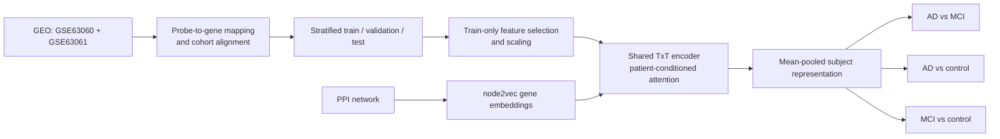
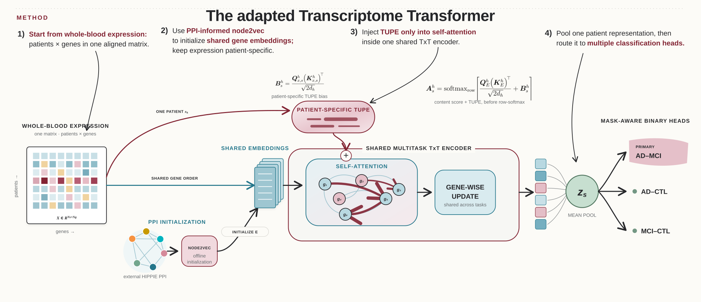

# Prediction of Alzheimer's Disease and Mild Cognitive Impairment from Blood Gene Expression Using Transcriptome Transformers

**Master's thesis project · research in progress**

This repository investigates cross-sectional classification of dataset-labelled Alzheimer's disease (AD), mild cognitive impairment (MCI), and cognitively normal controls from peripheral-blood gene expression. It combines a leakage-aware bioinformatics pipeline with an adapted, multi-task [Transcriptome Transformer (TxT)](https://doi.org/10.1093/bib/bbaf628).

The work is scheduled for presentation as a poster at **CIBB 2026** in Rome, Italy (3 September 2026).

> **Research use only.** This code is not a medical device, does not diagnose biological Alzheimer's disease, and does not predict conversion from MCI to dementia.

## Scientific question

AD and MCI have overlapping clinical and molecular profiles, while MCI is a heterogeneous syndrome rather than an obligatory stage of AD. Peripheral blood is accessible and scalable, but its transcriptomic signal is indirect, high-dimensional, and distributed across correlated genes. The primary task is therefore the difficult and comparatively underexplored **AD–MCI** distinction; AD–control and MCI–control are auxiliary comparisons.

## Pipeline



The implementation uses a shared Transformer encoder and three task-specific binary heads. Gene identity can be initialized from node2vec embeddings learned on a protein–protein interaction (PPI) network. Transcriptome-based positional encoding (TUPE) injects patient-specific expression into self-attention without replacing the shared gene embeddings.

<p align="center">
  
</p>

## Data

| GEO series | Retained samples | Platform |
|---|---:|---|
| [GSE63060](https://www.ncbi.nlm.nih.gov/geo/query/acc.cgi?acc=GSE63060) | 329 | Illumina HumanHT-12 v3.0 |
| [GSE63061](https://www.ncbi.nlm.nih.gov/geo/query/acc.cgi?acc=GSE63061) | 382 | Illumina HumanHT-12 v4.0 |
| **Aligned cohort** | **711** (284 AD, 189 MCI, 238 controls) | **19,460 shared genes** |

The repository does not redistribute the expression matrices. Acquisition, label filtering, probe-to-gene aggregation, and alignment are documented in [`task_dataset/README.md`](task_dataset/README.md). GEO accessions are public, but users remain responsible for complying with the source records' terms.

## Repository layout

```text
source/                  importable model and pipeline code
experiments/scripts/     data, training, evaluation, and figure entry points
pretraining_dataset/     GEO/PPI preparation scripts (generated data ignored)
task_dataset/            local data contract and generated datasets (ignored)
deg_analysis/            differential-expression and enrichment workflows
SOTA/source/             protocol-controlled reimplementations for comparison
tests/                   data-free unit and CLI tests
assets/poster/           selected original diagrams used in the documentation
Scrittura Tesi/          thesis LaTeX sources; downloaded papers are ignored
results/                 generated locally; only documentation is versioned
```

## Installation

Python 3.10–3.12 is recommended. Create an isolated environment from the repository root:

```bash
python3 -m venv .venv
source .venv/bin/activate          # Windows PowerShell: .venv\Scripts\Activate.ps1
python -m pip install --upgrade pip
python -m pip install -r requirements.txt
```

Optional reproduction baselines and generative augmentation require:

```bash
python -m pip install -r requirements-optional.txt
```

The GEO/DEG workflows use R (tested with R 4.5) and Bioconductor packages `GEOquery`, `Biobase`, `limma`, and optionally `sva` and `enrichR`. See [`docs/reproducibility.md`](docs/reproducibility.md).

## Prepare the data

Download and align the two GEO cohorts without storing them in Git:

```bash
Rscript pretraining_dataset/scripts/prepare_addneuromed_geo.R \
  --output-dir=task_dataset --install
```

Add `--combat` only to reproduce experiments that explicitly used global ComBat harmonization. Global ComBat is transductive because it sees all samples before splitting; this limitation is reported rather than hidden.

Create the canonical multiclass files and a diagnosis-stratified 70/10/20 split:

```bash
python experiments/scripts/baseline/build_alzheimer_dataset.py
python experiments/scripts/paper_comparison/build_txt_pairwise_datasets.py
```

Both commands print sample/gene counts. The expected aligned cohort is 711 samples and 19,460 genes; stop and inspect GEO annotations if those values change.

## Run TxT

Inspect the planned final pipeline without training:

```bash
python experiments/scripts/paper_comparison/run_txt_multitask_final_pipeline.py \
  --preset balanced --dry-run
```

Run a quick smoke configuration on CPU:

```bash
python experiments/scripts/paper_comparison/run_txt_multitask_cv_and_seeds.py \
  --run-mode seeds --architectures 1l2h --device cpu --smoke \
  --result-root results/smoke/txt_multitask
```

Run the repeated 10-seed protocol template used for the main comparisons after building the 64-dimensional PPI embedding:

```bash
python experiments/scripts/paper_comparison/run_txt_multitask_cv_and_seeds.py \
  --run-mode seeds --architectures 3l2h --device cuda \
  --seeds 101 102 103 104 105 106 107 108 109 110 \
  --seed-train-ratio 0.70 --seed-val-ratio 0.10 --seed-test-ratio 0.20 \
  --max-genes 2000 --gene-selection variance --scaler minmax \
  --d-model 64 --d-ff 256 --dropout 0.2 --batch-size 9 \
  --task-specific-pooling off --mask-aware-heads on --head-norm batch \
  --train-sampling balanced_classes --class-weighting off \
  --task-loss-weights 0.5 0.25 0.25 --tupe-mode on \
  --embed-file results/pretraining/ppi_init/hippie_highconf_dim64_score0p73_seed42/ppi_node_embedding.csv \
  --embedding-gene-policy mapped_only \
  --result-root results/paper_comparison/txt_multitask_3l2h
```

Use `--help` on each entry point before an expensive run. Full hyperparameter grids and PPI initialization commands are documented in [`experiments/scripts/paper_comparison/README_txt_multitask_final.md`](experiments/scripts/paper_comparison/README_txt_multitask_final.md).

## Differential expression and figures

The standalone R workflows are under `deg_analysis/Source/`. Thesis figures are generated by scripts in `Scrittura Tesi/scripts/`. Generated matrices, plots, checkpoints, and logs are intentionally excluded from version control.

## Results

The final thesis/poster table reports these repeated shared-test summaries:

| Task | Accuracy | Macro-F1 | ROC-AUC |
|---|---:|---:|---:|
| AD vs MCI | 0.632 | 0.599 | 0.661 |
| AD vs control | 0.740 | 0.736 | 0.843 |
| MCI vs control | 0.740 | 0.734 | 0.803 |

These values summarize the selected TxT configuration across repeated splits and are descriptive, not confidence intervals. Comparison tables produced by `SOTA/source/` are **exploratory shared-test screening**: configurations were selected by mean test ROC-AUC, so they are not untouched confirmatory benchmarks. The underlying run artifacts remain local rather than being redistributed; compact provenance and interpretation are documented in [`results/README.md`](results/README.md).

## Limitations

- Targets are recorded clinical labels, not uniformly amyloid/tau-confirmed disease states.
- This is cross-sectional classification, not MCI-to-AD progression prediction.
- Whole-blood expression is affected by cell composition, age, comorbidities, medication, handling, and platform effects.
- Both cohorts derive from a related research programme; independent external validation is still required.
- Attention-derived gene rankings are hypothesis-generating and do not establish causality or validated biomarkers.
- Sample size is small relative to dimensionality; repeated test partitions overlap.

## Verification

Data-free checks:

```bash
python -m compileall -q source experiments/scripts SOTA/source
python -m pytest -q
python experiments/scripts/paper_comparison/run_txt_multitask_cv_and_seeds.py --help
```

See [`docs/reproducibility.md`](docs/reproducibility.md) for tested environments, expensive steps, and known caveats.

## Author and supervision

**Tommaso Giorgini** — Master's Degree in Engineering in Computer Science and Artificial Intelligence, Sapienza University of Rome.

Supervisors: **Giulia Fiscon**, **Danilo Comminiello**, and **Eleonora Grassucci**.

## Citation

This repository is unpublished thesis software. Until a thesis or software release receives a persistent identifier, cite it using [`CITATION.cff`](CITATION.cff) and cite the original TxT article separately:

> Koo, B., Sung, I., Lee, S., & Kim, S. (2025). Transcriptome Transformer: improving patient survival prediction via multitask learning of transcriptomic and clinical features. *Briefings in Bioinformatics, 26*(6), bbaf628. https://doi.org/10.1093/bib/bbaf628

## Licensing and third-party material

No open-source licence has yet been granted for this repository. See [`NOTICE.md`](NOTICE.md) before reuse. In particular, the upstream TxT GitHub repository did not expose a software licence when this notice was prepared; the scientific article's publication licence does not automatically license its source code.
