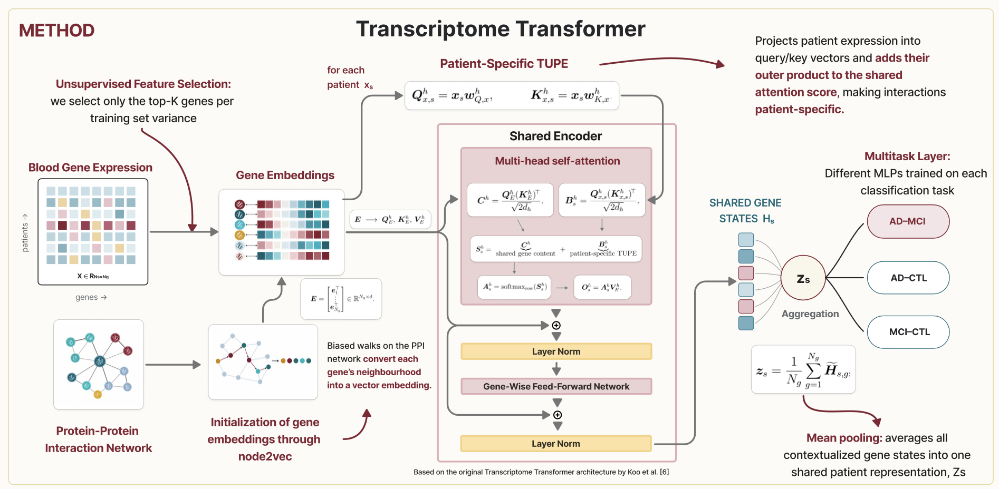

# Transcriptome Transformer for AD/MCI classification

> A focused, leakage-aware implementation of a multi-task Transcriptome Transformer for classifying dataset-labelled Alzheimer's disease (AD), mild cognitive impairment (MCI), and controls from blood gene expression.

This Master's thesis project adapts the [Transcriptome Transformer (TxT)](https://doi.org/10.1093/bib/bbaf628) to the difficult AD–MCI distinction. AD–control and MCI–control are learned as auxiliary binary tasks through the same encoder.

## Highlights

- One maintained trainer with the complete non-VMA experiment surface.
- Optional HIPPIE/node2vec initialization for biology-informed gene embeddings.
- Train-only feature selection, scaling, and augmentation.
- Fixed or generated diagnosis-stratified splits.
- Reproducible seeds, checkpoints, metrics, predictions, and manifests.
- Three clear entry points instead of historical launchers and one-off scripts.

  

## Results snapshot

| Task | Accuracy | Macro-F1 | ROC-AUC |
|---|---:|---:|---:|
| AD vs MCI | 0.632 | 0.599 | 0.661 |
| AD vs control | 0.740 | 0.736 | 0.843 |
| MCI vs control | 0.740 | 0.734 | 0.803 |

These are descriptive repeated-split summaries, not confidence intervals. See [results/README.md](results/README.md) for interpretation constraints.

## Repository structure

~~~text
data/download_geo.R       downloads and aligns the two public GEO cohorts
experiments/prepare_data.py
                          creates the canonical dataset and stratified split
experiments/build_ppi_embedding.py
                          downloads HIPPIE and learns node2vec embeddings
experiments/train.py      complete TxT multi-task trainer (non-VMA)
source/models/txt/        reusable TxT implementation
source/pipeline/          dataset, reporting, and reproducibility utilities
docs/                     quick-start and reproducibility notes
~~~

## Quick start

Install the base environment:

~~~bash
git clone https://github.com/tomgiorgini/transcriptome-transformer-ad-mci.git
cd transcriptome-transformer-ad-mci
python3 -m venv .venv
source .venv/bin/activate  # Windows: .venv\Scripts\activate
python -m pip install -r requirements.txt
~~~

Inspect every public entry point without downloading data:

~~~bash
python experiments/prepare_data.py --help
python experiments/build_ppi_embedding.py --help
python experiments/train.py --help
~~~

For an executable walkthrough, continue with [docs/quickstart.md](docs/quickstart.md).

## End-to-end usage

### 1. Download and align GEO data

~~~bash
Rscript data/download_geo.R --output-dir=task_dataset --install
python experiments/prepare_data.py
~~~

The expected aligned cohort is 711 samples: 284 AD, 189 MCI, and 238 controls across 19,460 shared genes.

### 2. Build the PPI initialization

~~~bash
python experiments/build_ppi_embedding.py \
  --embedding-dim 128 \
  --device cuda
~~~

This downloads HIPPIE when no local MITAB file is supplied, filters the graph, learns node2vec embeddings, and exports the embedding plus its provenance report.

### 3. Train TxT

~~~bash
python experiments/train.py \
  --device cuda \
  --seed 101 \
  --n-layers 1 --n-heads 2 \
  --d-model 128 --embed-dim 128 --d-ff 512 \
  --max-genes 2000 \
  --gene-selection ad_mci_vs_ctl_anova_50_50 \
  --task-specific-pooling on \
  --embed-file results/ppi_embeddings/hippie_highconf_dim128_score0p73_seed42/ppi_node_embedding.csv \
  --embedding-gene-policy mapped_only \
  --result-dir results/training/seed101
~~~

The trainer also supports random/PPI embeddings, multiple feature-selection strategies, custom splits, task-specific pooling, class weighting, balanced sampling, SMOTE, Borderline-SMOTE, PCA-neighbour augmentation, CTGAN, conditional GAN, checkpoint ensembles, alternative pooling, shared/separate encoders, and leakage ablations. Run <code>python experiments/train.py --help</code> for the authoritative option list.

Generative augmentation backends require:

~~~bash
python -m pip install -r requirements-optional.txt
~~~

## Outputs

Each run writes a self-contained result directory including:

- <code>model_summary.json</code> and <code>args.json</code>;
- <code>training_log.csv</code>;
- split metrics, predictions, and confusion matrices;
- selected genes and embedding provenance;
- <code>best_model.pt</code> and optional checkpoint-ensemble members.

## Verification

~~~bash
python -m compileall -q source experiments
python experiments/prepare_data.py --help
python experiments/build_ppi_embedding.py --help
python experiments/train.py --help
~~~

The same data-free checks run in GitHub Actions on Python 3.10 and 3.12.

## Scientific scope

This is research software, not a medical device. It classifies cross-sectional dataset labels; it does not diagnose biological Alzheimer's disease or predict MCI-to-dementia conversion. Independent external validation is still required, and attention-derived gene rankings are hypothesis-generating rather than causal biomarkers.

## Author, citation, and licence

**Tommaso Giorgini** — Master's Degree in Engineering in Computer Science and Artificial Intelligence, Sapienza University of Rome.

Supervisors: **Giulia Fiscon**, **Danilo Comminiello**, and **Eleonora Grassucci**.

Use [CITATION.cff](CITATION.cff) to cite the project. No open-source licence has yet been granted; review [NOTICE.md](NOTICE.md) before reuse.
