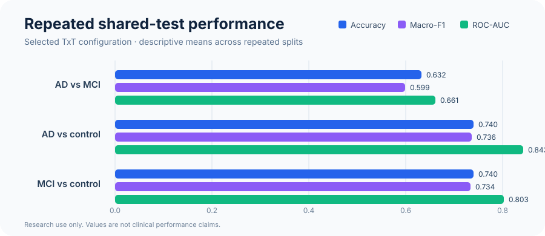

# Transcriptome Transformer for AD/MCI classification

[](https://github.com/tomgiorgini/transcriptome-transformer-ad-mci/actions/workflows/ci.yml)


> A leakage-aware, multi-task Transformer pipeline for classifying dataset-labelled Alzheimer's disease (AD), mild cognitive impairment (MCI), and controls from peripheral-blood gene expression.

This Master's thesis project adapts the [Transcriptome Transformer (TxT)](https://doi.org/10.1093/bib/bbaf628) to a clinically difficult setting: separating AD from MCI while learning AD–control and MCI–control as auxiliary tasks.

## Why this project stands out

- **End-to-end research engineering:** GEO acquisition, probe-to-gene mapping, feature selection, training, evaluation, and interpretation.
- **Leakage-aware evaluation:** train-only feature selection and scaling, validation-only checkpointing, fixed split manifests, and no validation/test augmentation.
- **Biology-informed modelling:** optional node2vec initialization from a protein–protein interaction network and patient-conditioned attention.
- **Reproducible experiments:** deterministic seeds, machine-readable manifests, data-free tests, smoke runs, and documented limitations.
- **Honest reporting:** AD–MCI remains the hardest task; exploratory screening is explicitly separated from confirmatory evaluation.

<p align="center">
  
</p>

## Results snapshot

The selected TxT configuration was evaluated on repeated, diagnosis-stratified shared-test splits.

<p align="center">
  
</p>

| Task | Accuracy | Macro-F1 | ROC-AUC |
|---|---:|---:|---:|
| AD vs MCI | 0.632 | 0.599 | 0.661 |
| AD vs control | 0.740 | 0.736 | 0.843 |
| MCI vs control | 0.740 | 0.734 | 0.803 |

These are descriptive repeated-split summaries, not confidence intervals. Test partitions overlap across seeds. See [results/README.md](results/README.md) for provenance and interpretation constraints.

## Quick start: inspect the pipeline in 5 minutes

The following path validates installation and prints the complete experiment plan without downloading data or training a model.

```bash
git clone https://github.com/tomgiorgini/transcriptome-transformer-ad-mci.git
cd transcriptome-transformer-ad-mci

python3 -m venv .venv
source .venv/bin/activate  # Windows: .venv\Scripts\activate
python -m pip install -r requirements.txt

python experiments/scripts/paper_comparison/run_txt_multitask_final_pipeline.py \
  --preset balanced --dry-run
```

Expected final line:

```text
Dry run complete. Planned steps: 5.
```

<p align="center">
  
</p>

Continue with the [step-by-step quick-start](docs/quickstart.md), which separates data-free validation, local smoke training, and the full GPU experiment.

## Data

| GEO series | Retained samples | Platform |
|---|---:|---|
| [GSE63060](https://www.ncbi.nlm.nih.gov/geo/query/acc.cgi?acc=GSE63060) | 329 | Illumina HumanHT-12 v3.0 |
| [GSE63061](https://www.ncbi.nlm.nih.gov/geo/query/acc.cgi?acc=GSE63061) | 382 | Illumina HumanHT-12 v4.0 |
| **Aligned cohort** | **711** (284 AD, 189 MCI, 238 controls) | **19,460 shared genes** |

Expression matrices are not redistributed. The reproducible acquisition and alignment workflow is documented in [task_dataset/README.md](task_dataset/README.md).

## How the pipeline works

1. Download GSE63060 and GSE63061 from GEO.
2. Map platform-specific probes to shared gene symbols and align samples.
3. Create diagnosis-stratified train/validation/test manifests.
4. Fit feature selection and scaling on the training partition only.
5. Optionally initialize genes from a PPI node2vec embedding.
6. Train a shared TxT encoder with three masked binary heads.
7. Export metrics, checkpoints, manifests, and attention analyses per seed.

The model uses a shared Transformer encoder with task-specific heads. Transcriptome-based positional encoding injects patient expression into attention, while gene identity remains shared across subjects.

## Repository map

```text
source/                  reusable TxT, T-GEM and pipeline modules
experiments/scripts/     data, training, evaluation and analysis entry points
pretraining_dataset/     reproducible GEO/PPI preparation scripts
task_dataset/            data contract; generated matrices stay local
SOTA/source/             protocol-controlled literature reproductions
deg_analysis/            differential-expression workflows
tests/                   data-free model, protocol and CLI tests
docs/                    quick-start and reproducibility documentation
results/                 generated locally; only the provenance policy is tracked
```

## Reproduce the study

Prepare the aligned GEO data:

```bash
Rscript pretraining_dataset/scripts/prepare_addneuromed_geo.R \
  --output-dir=task_dataset --install

python experiments/scripts/baseline/build_alzheimer_dataset.py
python experiments/scripts/paper_comparison/build_txt_pairwise_datasets.py
```

Run a short CPU smoke experiment:

```bash
python experiments/scripts/paper_comparison/run_txt_multitask_cv_and_seeds.py \
  --run-mode seeds --architectures 1l2h --device cpu --smoke \
  --result-root results/smoke/txt_multitask
```

Full grids, PPI initialization, cost tiers, tested environments, and known caveats are documented in:

- [Quick start](docs/quickstart.md)
- [Reproducibility notes](docs/reproducibility.md)
- [Final multi-task protocol](experiments/scripts/paper_comparison/README_txt_multitask_final.md)
- [SOTA comparison protocol](SOTA/source/SHARED_TEST_BENCHMARK.md)

## Verification

```bash
python -m compileall -q source experiments/scripts SOTA/source
python -m pytest -q tests
```

The same checks run on every push and pull request through GitHub Actions.
The SOTA-specific suites additionally require `requirements-optional.txt`.

## Scientific scope and limitations

This is **research software**, not a medical device. It classifies cross-sectional dataset labels; it does not diagnose biological Alzheimer's disease and does not predict MCI-to-dementia conversion.

- Labels are not uniformly amyloid/tau-confirmed disease states.
- Whole-blood expression is affected by cell composition and clinical/technical confounders.
- Both cohorts come from a related research programme; independent external validation is still required.
- Attention-derived gene rankings are hypothesis-generating, not causal or validated biomarkers.
- The sample size is small relative to transcriptomic dimensionality.

## Author and citation

**Tommaso Giorgini** — Master's Degree in Engineering in Computer Science and Artificial Intelligence, Sapienza University of Rome.

Supervisors: **Giulia Fiscon**, **Danilo Comminiello**, and **Eleonora Grassucci**.

Use [CITATION.cff](CITATION.cff) to cite this repository and cite the original TxT article separately.

## Licence and third-party material

No open-source licence has yet been granted. Review [NOTICE.md](NOTICE.md) before reuse, particularly for code adapted from the upstream TxT repository.
