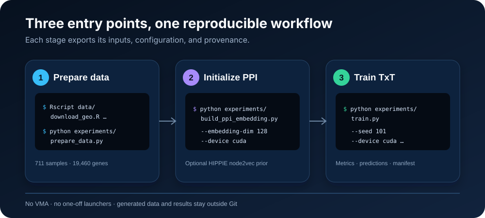

# Quick start

The public interface contains three Python entry points and one data-acquisition helper.

## 1. Environment

~~~bash
python3 -m venv .venv
source .venv/bin/activate
python -m pip install --upgrade pip
python -m pip install -r requirements.txt
~~~

Python 3.10–3.12 and PyTorch 2.x are recommended.

## 2. Data

Download GSE63060 and GSE63061, map probes to genes, retain AD/MCI/control samples, and align shared genes:

~~~bash
Rscript data/download_geo.R --output-dir=task_dataset --install
~~~

Create <code>X.csv</code>, <code>y.csv</code>, and the diagnosis-stratified 70/10/20 split:

~~~bash
python experiments/prepare_data.py
~~~

Expected checks:

~~~text
Samples: 711
Genes: 19460
~~~

Generated participant-level files stay under <code>task_dataset/</code> and are ignored by Git.

## 3. Optional PPI initialization

~~~bash
python experiments/build_ppi_embedding.py \
  --embedding-dim 128 \
  --score-threshold 0.73 \
  --seed 42 \
  --device cuda
~~~

Use <code>--device cpu</code> on machines without CUDA. The command downloads the current HIPPIE MITAB file unless <code>--hippie-file</code> is supplied.

## 4. Train

CPU smoke run:

~~~bash
python experiments/train.py \
  --device cpu \
  --epochs 1 \
  --max-genes 128 \
  --max-train-batches 2 \
  --max-val-batches 1 \
  --result-dir results/smoke
~~~

Maintained PPI-initialized configuration:

~~~bash
python experiments/train.py \
  --device cuda \
  --seed 101 \
  --n-layers 1 --n-heads 2 \
  --d-model 128 --embed-dim 128 --d-ff 512 \
  --dropout 0.4 --batch-size 16 \
  --epochs 100 --early-stopping-patience 30 \
  --max-genes 2000 \
  --gene-selection ad_mci_vs_ctl_anova_50_50 \
  --task-specific-pooling on \
  --embed-file results/ppi_embeddings/hippie_highconf_dim128_score0p73_seed42/ppi_node_embedding.csv \
  --embedding-gene-policy mapped_only \
  --result-dir results/training/seed101
~~~

Use a distinct <code>--result-dir</code> for every seed or configuration.

## Option groups

<code>experiments/train.py --help</code> is the authoritative reference. Its main controls cover:

| Group | Examples |
|---|---|
| Data and split | official/custom/stratified/random split, train/validation/test ratios |
| Features | variance, MAD, pairwise ANOVA, AD–MCI-priority ANOVA |
| Embeddings | random, direct PPI, gated-residual PPI, mapped-only gene universe |
| Architecture | layers, heads, dimensions, pooling, shared/separate encoders, TUPE |
| Optimization | learning rates, weight decay, class weights, task weights, early stopping |
| Augmentation | SMOTE, Borderline-SMOTE, PCA neighbours, CTGAN, conditional GAN |
| Evaluation | checkpoint metric, per-epoch diagnostics, checkpoint ensemble |

No volumetric-modulated-attention (VMA) implementation or option is included.
